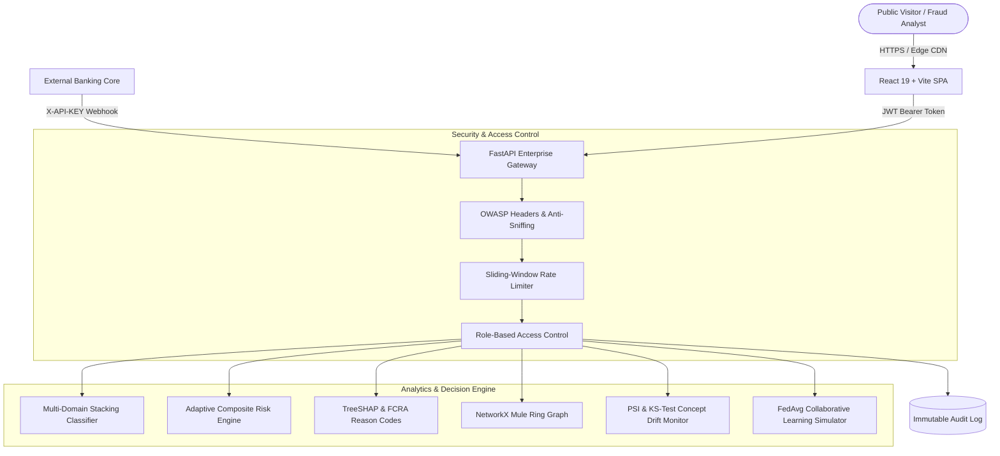

# FraudShield AI — Real-Time Financial Fraud Intelligence & Explainable AI Platform

<div align="center">

[](https://fastapi.tiangolo.com)
[](https://vitejs.dev)
[](https://xgboost.readthedocs.io)
[](https://github.com/slundberg/shap)
[](https://docker.com)
[](https://pages.github.com)
[](https://vercel.com)

[](https://render.com)
[](LICENSE)

**Next-Generation Multi-Domain Fraud Intelligence, Explainable AI (XAI), Graph Analytics, and Cross-Institutional Federated Defense**

[Live Web App](#quickstart--local-development) • [Deployment Guide](DEPLOYMENT.md) • [Swagger API Docs (:8008/docs)](#rest-api-reference) • [Demo Personas](#demo-personas--role-based-access-control)

</div>

---

## 🌟 Executive Overview

**FraudShield AI** is an enterprise-grade financial fraud intelligence platform engineered to bridge the gap between high-dimensional machine learning detection and regulatory compliance (**FCRA / GDPR Article 22 Right to Explanation**).

Unlike conventional black-box fraud classifiers, FraudShield combines:
1. **Multi-Domain Stacking Ensemble**: Simultaneous detection across **PaySim** (Mobile Money/P2P), **European Credit Cards** (PCA Anomaly Vectors), **Spatial & Behavioral** (Haversine Geo-Discrepancies), and **BankSim** (Retail Merchant Agent Modeling).
2. **Adaptive Multi-Signal Risk Engine**: Composite risk scoring fusing ML output with customer velocity profiles, device fingerprints, and graph heuristics.
3. **Explainable AI (TreeSHAP)**: Translates mathematical feature attribution into plain-English reason codes (e.g. *RC-BAL-02: Account Balance Liquidation Discrepancy*) with automated adverse action letters.
4. **Graph Intelligence & Mule Ring Detection**: Real-time cycle detection and community clustering to uncover synthetic identity rings and mule accounts.
5. **Continuous MLOps Drift Monitoring**: Kolmogorov-Smirnov (KS) tests and Population Stability Index (PSI) tracking covariate shift with an adversarial threat injection sandbox.
6. **Federated Learning Defense**: Decentralized FedAvg simulation enabling collaborative model training across multiple institutions without sharing raw customer PII.
7. **Enterprise Security & RBAC**: Cryptographic JWT sessions, sliding-window anti-DDoS rate limiting, OWASP security headers, and an immutable audit trail.

---

## 🏗️ System Architecture



---

## 👥 Demo Personas & Role-Based Access Control

FraudShield AI provides **1-Click Demo Personas** in the **Identity Portal** so visitors and evaluators can experience every role instantly with zero registration friction:

| Persona | Pre-configured Email | Password | Role Key | Permissions & Access Scope |
| :--- | :--- | :--- | :--- | :--- |
| **Sarah Chen, CISSP** | `analyst@fraudshield.ai` | `analyst123` | `soc_analyst` | Real-time transaction stream triage, risk scoring, network graph, manual reviews. |
| **Marcus Vance, CAMS** | `compliance_officer` | `compliance123` | `compliance_officer` | TreeSHAP attribution waterfall, FCRA reason cards, concept drift audits, benchmarks. |
| **Dr. Elena Rostova** | `admin@fraudshield.ai` | `admin123` | `admin` | Full control: FedAvg weight aggregation, synthetic drift spikes, API key issuance. |

Visitors can also create custom accounts with custom roles via the **Create Account** tab.

---

## ⚡ Quickstart — Local Development

### Prerequisites
- Python 3.11+
- Node.js 18+ and npm

### 1. Clone Repository
```bash
git clone https://github.com/your-username/FraudShield_AI.git
cd FraudShield_AI
```

### 2. Backend Setup
```bash
cd backend
python -m venv .venv
source .venv/bin/activate  # On Windows: .venv\Scripts\activate
pip install -r requirements.txt
python -m uvicorn main:app --host 0.0.0.0 --port 8008 --reload
```
API will be live at `http://localhost:8008` (Interactive Swagger at `http://localhost:8008/docs`).

### 3. Frontend Setup
In a new terminal window:
```bash
cd frontend
npm install
npm run dev
```
Open `http://localhost:3000` in your browser.

---

## 🐳 Docker Deployment

Run both the frontend and backend using Docker Compose:

```bash
docker-compose up -d --build
```
- **Frontend**: `http://localhost:3000` (Served via high-performance Nginx with gzip compression)
- **Backend API**: `http://localhost:8008` (Served via Uvicorn with non-root security)

---

## ☁️ Public Cloud Deployment (100% Free)

Deploy FraudShield to the public internet for free in under 5 minutes:

1. **Deploy Backend to [Render](https://dashboard.render.com/)**:
   - Create a **New Web Service** pointing to your repository.
   - Set Root Directory to `backend`, Runtime to `Docker`.
   - Set environment variables: `PORT=8008`, `ALLOWED_ORIGINS=*`.
2. **Deploy Frontend to [Vercel](https://vercel.com/)**:
   - Import your repository.
   - Set Root Directory to `frontend`.
   - Set environment variable: `VITE_API_URL=https://your-backend.onrender.com`.
   - Deploy! Vercel serves the app globally with automatic SSL.

For full cloud hosting instructions, see [DEPLOYMENT.md](DEPLOYMENT.md).

---

## 📡 REST API Reference

### Real-Time Transaction Scoring
```bash
curl -X POST "http://localhost:8008/analyze?domain=paysim" \
  -H "Content-Type: application/json" \
  -H "X-API-KEY: fs_live_banking_partner_key_889" \
  -d '{
    "step": 1,
    "type": "TRANSFER",
    "amount": 180000.00,
    "nameOrig": "C1002341",
    "oldbalanceOrg": 180000.00,
    "newbalanceOrig": 0.00,
    "nameDest": "M9081231",
    "oldbalanceDest": 0.00,
    "newbalanceDest": 0.00
  }'
```

### Key Endpoints
| Endpoint | Method | Role Required | Description |
| :--- | :---: | :---: | :--- |
| `/health` | `GET` | Public | System health check and model loading state. |
| `/auth/login` | `POST` | Public | Authenticate via email/password or 1-click persona. |
| `/auth/register` | `POST` | Public | Self-register a new user profile with role. |
| `/auth/audit-logs` | `GET` | `compliance` / `admin` | View immutable security audit trail. |
| `/analyze` | `POST` | Public / API Key | Multi-signal inference, TreeSHAP, and reason codes. |
| `/graph/network` | `GET` | `soc_analyst` / `admin` | Full network graph topology and mule score. |
| `/drift/status` | `GET` | Public | Real-time PSI and KS-test covariate shift metrics. |
| `/drift/simulate-spike` | `POST` | `admin` | Inject synthetic adversarial drift vector. |
| `/federated/state` | `GET` | Public | Decentralized model performance and bank metrics. |
| `/federated/simulate-round` | `POST` | `admin` | Trigger FedAvg global gradient aggregation. |

---

## 🧪 Terminal Live Stream Simulator

Simulate high-throughput live banking transaction streams into the running system:

```bash
python scripts/stream_simulator.py
```

---

## 🎓 Academic & Engineering Credits

- **Institution**: Thakur College of Engineering & Technology (TCET), Mumbai
- **Student Engineering Team**: Ashmit Singh, Sumit Singh, Shivam Singh
- **Project Mentor & Guide**: Ms. Tanmayi Nagale
- **Research Documentation**: Full whitepaper and empirical benchmark methodology available in [`research/docs/research_paper.md`](research/docs/research_paper.md) and [`PROJECT_DOSSIER.md`](PROJECT_DOSSIER.md).

---

<div align="center">
  <sub>Built with ❤️ for resilient, explainable, and ethical financial intelligence.</sub>
</div>
